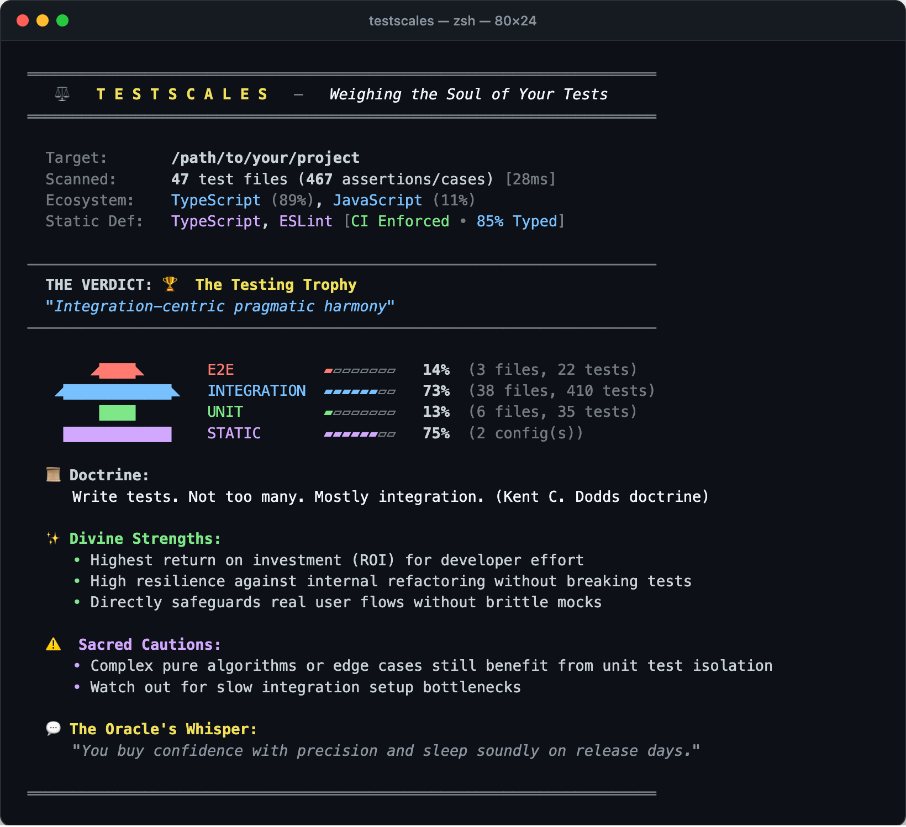

# Testscales ⚖️

> **Weigh the soul and archetype of your test suite with divine precision.**

<p align="center">
  <a href="https://github.com/nukoneko-tarou/testscales/actions"></a>
  <a href="https://www.npmjs.com/package/testscales"></a>
  <a href="https://nodejs.org/"></a>
  <a href="LICENSE"></a>
</p>

Is your codebase a **Testing Trophy**, a **Classic Pyramid**, an **Ice Cream Cone**, or **Prayer-Driven Void**?

`testscales` is a zero-config, blazing-fast CLI that scans your repository, categorizes your tests across four strata (Static, Unit, Integration, E2E), and weighs them on the ancient scales of software engineering to reveal your **testing archetype**.

```bash
npx testscales
```

---

## 📸 Output Preview

<p align="center">
  
</p>

---

## ⚡ Performance Benchmarks

Tested across major open-source codebases, completing analysis in milliseconds:

| Codebase | Total Files in Repo | Tests Analyzed | Scan Time | Verdict |
| :--- | :---: | :---: | :---: | :--- |
| **Node.js Runtime** (`nodejs/node`) | **51,857 files** | **52,045 tests** (6,391 files) | **1.3 s** ⚡ | 🔺 The Classic Pyramid |
| **Laravel Framework** (`laravel/framework`) | 3,418 files | **13,118 tests** (996 files) | **203 ms** ⚡ | 🔺 The Classic Pyramid |
| **Ruby on Rails** (`rails/rails`) | 5,004 files | **18,284 tests** (1,312 files) | **365 ms** ⚡ | 🔺 The Classic Pyramid |
| **React** (`facebook/react`) | 7,252 files | **6,130 tests** (587 files) | **2.4 s** | 🗡️ The Monolith Spike |
| **FastAPI** (`fastapi/fastapi`) | 3,139 files | **2,431 tests** (612 files) | **73 ms** ⚡ | 🗡️ The Monolith Spike |
| **Gin Web Framework** (`gin-gonic/gin`) | 130 files | **647 tests** (40 files) | **23 ms** ⚡ | 🏆 The Testing Trophy |

---

## 🏛️ The Divine Archetypes

`testscales` is **dogma-neutral**. There is no single "right" shape—each archetype reflects distinct tradeoffs appropriate for different engineering goals:

| Archetype | Silhouette | Best Suited For | Philosophy |
| :--- | :---: | :--- | :--- |
| **🏆 The Testing Trophy** | Trophy | Modern Web & Full-stack | Integration-first. Maximum ROI and user flow confidence. |
| **🔺 The Classic Pyramid** | Pyramid | Domain Logic & Pure Libs | Unit-heavy granite foundation. Instant sub-second test runs. |
| **💎 The Integration Diamond** | Diamond | Microservices & APIs | Boundary contracts, database transactions, protocol gates. |
| **🍦 The Ice Cream Cone** | Cone | UI / Critical Flows | Real browser testing at top, but watch out for slow CI times. |
| **⌛ The Hourglass** | Hourglass | Polarized Suites | Pure units + full smoke journeys, with middle integration omitted. |
| **🗡️ The Monolith Spike** | Spike | Hyper-focused projects | One layer commands 80%+ of test weight. |
| **⚖️ The Scales of Equanimity** | Balance | Defense-in-depth | Symmetrical equilibrium across all four layers. |
| **🛡️ The Prayer-Driven Void** | Void | YOLO & Fast Prototypes | Zero tests. "Production is the ultimate test suite." |

---

## 🚀 Usage

### Run directly with `npx`
```bash
npx testscales
```

### Inspect a specific directory
```bash
npx testscales ./packages/server
```

### Verbose Mode (Inspect reason per file)
```bash
npx testscales --verbose
```

### JSON Output (CI / Pipeline integration)
```bash
npx testscales --json
```

---

## ⚙️ CLI Options

| Flag | Description | Default |
| :--- | :--- | :--- |
| `[dir]` | Target directory to weigh | `.` (current dir) |
| `--verbose` | Output layer breakdown and heuristic reasons for every file | `false` |
| `--json` | Output results in JSON format (includes `ciAssertion` if gates applied) | `false` |
| `--ci` | CI mode: enforces policy rules and exits with code 1 on violations (forbids `void` by default) | `false` |
| `--assert <types>` | Assert archetype matches expected list (e.g. `trophy,pyramid`) | |
| `--expect <types>` | Alias for `--assert` | |
| `--forbid <types>` | Fail if archetype matches forbidden list (e.g. `void,ice-cream-cone`) | |
| `--min-static <pct>` | Fail if STATIC percentage is below threshold (e.g. `10`) | |
| `--max-e2e <pct>` | Fail if E2E percentage exceeds threshold (e.g. `25`) | |
| `--min-integration <pct>` | Fail if INTEGRATION percentage is below threshold (e.g. `30`) | |
| `--min-unit <pct>` | Fail if UNIT percentage is below threshold (e.g. `20`) | |
| `--ignore <patterns>` | Comma-separated glob patterns to ignore | `node_modules,dist,...` |
| `-v, --version` | Output testscales version | |
| `-h, --help` | Display CLI help menu | |

---

## 🛡️ CI Enforcement & Guardrails

Prevent architecture decay over time. Use `testscales` in your CI pipeline as a quality gate to fail builds if your test suite drifts into forbidden shapes or violates layer boundaries:

```bash
# Enforce a Testing Trophy architecture
npx testscales --assert trophy

# Allow either Trophy or Pyramid, but forbid Void or Ice Cream Cone
npx testscales --assert trophy,pyramid --forbid ice-cream-cone,void

# Guardrails: Cap slow E2E tests at 20% and require at least 15% static defense
npx testscales --max-e2e 20 --min-static 15

# Default CI mode: passes normal tests, immediately fails on "Prayer-Driven Void"
npx testscales --ci
```

### GitHub Actions Workflow

```yaml
name: Test Suite Shape Gate
on: [pull_request, push]

jobs:
  testscales:
    runs-on: ubuntu-latest
    steps:
      - uses: actions/checkout@v7
      - uses: actions/setup-node@v4
        with:
          node-version: 22
      - run: npx testscales --assert trophy,diamond --max-e2e 25
```

---

## 🌐 Supported Ecosystems & Frameworks

* **TypeScript / JavaScript**: Vitest, Jest, Playwright, Cypress, Testing Library, Storybook Interaction Testing (`play()`)
* **PHP**: Laravel (Dusk, Feature, Unit), CakePHP (`IntegrationTestTrait`, Model/Table), Symfony (Panther, WebTestCase), Pest, PHPUnit, PHPStan, Psalm, Pint, Rector
* **Python**: `pytest`, `unittest`, Django Test Client, FastAPI / Starlette `TestClient`, Playwright-Python, Selenium
* **Go**: `testing`, `net/http/httptest`, `testcontainers-go`, `chromedp`, `testify/mock`, `gomock`
* **Ruby**: RSpec, Rails System/Feature Specs (Capybara), Request/API Specs, VCR, WebMock, Model Specs

---

## 🧪 Programmatic API

While most teams use the CLI directly, `testscales` exports fully typed APIs for custom automation, bots, and platform engineering:

```typescript
import { weighRepository } from 'testscales'

const result = await weighRepository('./my-repo', {
  verbose: true,
})

console.log(result.verdict.name) // "The Classic Pyramid"
console.log(result.layers.unit.percentage) // 76
```

### Common Use Cases

* **🤖 PR Review & ChatOps Bots**: Comment on pull requests when a diff degrades testing balance (e.g. drifting from *Testing Trophy* toward *Ice Cream Cone*).
* **📊 Engineering Metrics Dashboards**: Aggregate test suite archetypes across hundreds of company repositories in scheduled batch jobs.
* **📈 Drift & Regression Alarms**: Write custom CI scripts comparing PR metrics against base branch baselines (e.g., alert if E2E ratio increases by >5%).
* **🔌 Internal Developer Tooling**: Embed `testscales` into corporate CLI diagnostics tools (e.g., `company-cli doctor`).

---

## 📄 License

MIT © [nukoneko-tarou](https://github.com/nukoneko-tarou)
